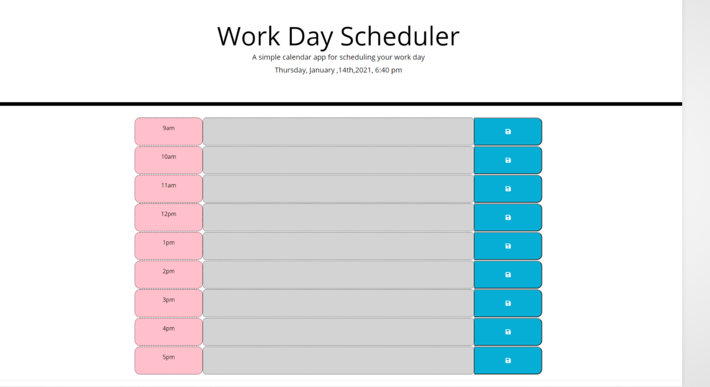

## HomeWork Assignment
### Day-planner

Using jquery build a day- planner application that helps the user to manage the 
appointments for a day from 9am to 5 pm.
The application uses the localstorage to set and retrieve the appointments.
Have used jquery, bootstrap and moment.js libraries.
The text area of the description boxes changes with the time based on past,
present and current hour. If it is current hour the text box apperas in red,
if it is past hour it appears in grey and if it is future hour it appears green.
when the user types in the description in the text area and click the save button to 
it's right the text inside the input box will be saved and when the page refreshes and 
when the user closes the window and comes back the data still persists.
## Mockup
The following is the mockup of this application

## Github page of this application

[day-planner](https://selvivini.github.io/jquery-dayplanner/)

